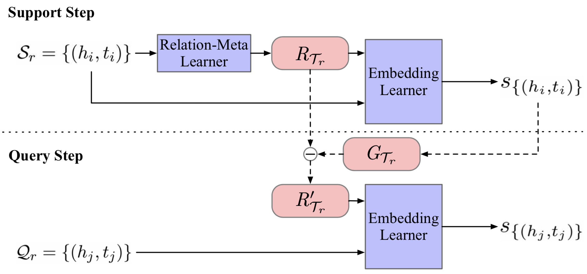

# MetaR

This repo shows the source code of EMNLP 2019 paper: [**Meta Relational Learning for Few-Shot Link Prediction in Knowledge Graphs**](https://www.aclweb.org/anthology/D19-1431/). In this work, we propose a Meta Relational Learning (MetaR) framework to do the common but challenging few-shot link prediction in KGs, namely predicting new triples about a relation by only observing a few associative triples. 

<p align="center"></p>

## Running the Experiments

### Requirements

+ Python 3.6.7
+ PyTorch 1.0.1
+ tensorboardX 1.8

You can also install dependencies by

```bash
pip install -r requirements.txt
```

### Dataset

We use NELL-One and Wiki-One to test our MetaR, and these datasets were firstly proposed by xiong. The orginal datasets and pretrain embeddings can be downloaded from [xiong's repo](https://github.com/xwhan/One-shot-Relational-Learning). You can also download the zip files where we put the datasets and pretrain embeddings together from [Dropbox](https://www.dropbox.com/sh/d04wbxx8g97g1rb/AABDZc-2pagoGhKzNvw0bG07a?dl=0). Note that all these files were provided by xiong and we just select what we need here.

### Prepare

Here is a preparation step if you use the orginal datasets and embeddings from [xiong's repo](https://github.com/xwhan/One-shot-Relational-Learning). Note that if you use our released datasets from [Dropbox](https://www.dropbox.com/sh/d04wbxx8g97g1rb/AABDZc-2pagoGhKzNvw0bG07a?dl=0), just **skip** this step and the datasets do not need any preparation.

This preparation is mainly for forming the data of *BG: In-Train* setting, and unifies some file formats. **Firstly**,  copy the corresponding embedding file  ``Entity2vec.TransE``  to dataset folders, like ``./NELL `` or ``./Wiki`` . **Secondly**, prepare the datasets for *BG: In-Train* setting which we introduce in our paper by running

```bash
python prepare.py --dataset_path {path_of_dataset} --data_name {name_of_dataset}
```

+ ``{path_of_dataset}`` specify the  dataset path like ``./NELL``, ``./Wiki``;

+ ``{name_of_dataset}`` specify the corresponding dataset name like ``NELL-One``, ``Wiki-One``.

For example

```bash
python prepare.py --data_path ./NELL --data_name NELL-One
python prepare.py --data_path ./Wiki --data_name Wiki-One
```

This script forms the data for *BG: In-Train* setting from original datasets, and you only need to run this script once before you running the following experiments.

### Quick Start for Training & Testing

For training and testing MetaR, here is an example for queick start,

```bash
# NELL-One, 1-shot, BG:Pre-Train
python main.py --dataset NELL-One --data_path ./NELL --few 1 --data_form Pre-Train --prefix nellone_1shot_pretrain --device 0
```

Here are explanations of some important args,

```bash
--dataset:   "the name of dataset, NELL-One or Wiki-One"
--data_path: "directory of dataset"
--few:       "the number of few in {few}-shot, as well as instance number in support set"
--data_form: "dataset setting, Pre-Train or In-Train"
--prefix:    "given name of current experiment"
--device:    "the GPU number"
```

Normally, other args can be set to default values. See ``params.py`` for more details about argus if needed.

### More Details

#### Log and State

Folder ``./log`` and ``./state`` will be make after starting an expariment. The log and a whole state of MetaR will be saved at ```{--log_dir}/{--prefix}``` and ```{--state_dir}/{--prefix}``` each ``{--eval_epoch}`` and ``{--checkpoint_epoch}``, and their default values are set to 1000. For example, if current experiment prefix is ``exp1``, here is the directory tree for log and state, 

```
.
|-- log
|   \-- exp1
|       |-- events.out.tfevents.{num}.{username}  # tensorboard log
|       \-- res.log  # evaluation log during training and test log from logging module 
\-- state
    \-- exp1
        |-- checkpoint  # saved state every checkpoint_epoch
        \-- state_dict  # final state
```

The evaluation results and fianl results on dev set and test set will be logged at ```{--log_dir}/{--prefix}/res.log```.

#### TensorboardX

```
tensorboard --logdir {log_dir}
```

```log_dir``` is the directory of log which is specified by ```--log_dir``` when running ```main.py```, and its default values is  ```./log```.

## Experiment Results

Under the default setting of parameters in the source code, we can get the following results. Corresponding command lines for running experiments are listed.

+ NELL-One

  + 1-Shot Link Prediction

    ```bash
    python main.py --dataset NELL-One --data_path ./NELL --prefix nellone_1shot_pretrain --device 0
    python main.py --dataset NELL-One --data_path ./NELL --data_form In-Train --prefix nellone_1shot_intrain --device 0
    ```

    | Model (Setting)      | MRR  | Hits@10 | Hits@5 | Hits@1 |
    | -------------------- | ---- | ------- | ------ | ------ |
    | MetaR (BG:Pre-Train) | .225 | .350    | .286   | .159   |
    | MetaR (BG:In-Train)  | .308 | .475    | .406   | .216   |

  + 5-Shot Link Prediction

    ```bash
    python main.py --dataset NELL-One --data_path ./NELL --few 5 --prefix nellone_5shot_pretrain --device 0
    python main.py --dataset NELL-One --data_path ./NELL --few 5 --data_form In-Train --prefix nellone_5shot_intrain --device 0
    ```

    | Model (Setting)      | MRR  | Hits@10 | Hits@5 | Hits@1 |
    | -------------------- | ---- | ------- | ------ | ------ |
    | MetaR (BG:Pre-Train) | .238 | .375    | .321   | .163   |
    | MetaR (BG:In-Train)  | .313 | .499    | .420   | .214   |

+ Wiki-One

  - 1-Shot Link Prediction

    ```bash
    python main.py --dataset Wiki-One --data_path ./Wiki --prefix wikione_1shot_pretrain --device 0
    python main.py --dataset Wiki-One --data_path ./Wiki --data_form In-Train --prefix wikione_1shot_intrain --device 0
    ```

    | Model (Setting)      | MRR  | Hits@10 | Hits@5 | Hits@1 |
    | -------------------- | ---- | ------- | ------ | ------ |
    | MetaR (BG:Pre-Train) | .323 | .414    | .373   | .275   |
    | MetaR (BG:In-Train)  | .189 | .286    | .234   | .142   |

  - 5-Shot Link Prediction

    ```Bash
    python main.py --dataset Wiki-One --data_path ./Wiki --few 5 --prefix wikione_5shot_pretrain --device 0
    python main.py --dataset Wiki-One --data_path ./Wiki --few 5 --data_form In-Train --prefix wikione_5shot_intrain --device 0
    ```

    | Model (Setting)      | MRR  | Hits@10 | Hits@5 | Hits@1 |
    | -------------------- | ---- | ------- | ------ | ------ |
    | MetaR (BG:Pre-Train) | .333 | .446    | .396   | .277   |
    | MetaR (BG:In-Train)  | .228 | .321    | .273   | .182   |


## Cite

```
@inproceedings{chen-etal-2019-meta,
    title     = "Meta Relational Learning for Few-Shot Link Prediction in Knowledge Graphs",
    author    = "Chen, Mingyang  and
                 Zhang, Wen  and
                 Zhang, Wei  and
                 Chen, Qiang  and
                 Chen, Huajun",
    booktitle = "Proceedings of the 2019 Conference on Empirical Methods in Natural Language Processing and the 9th International Joint Conference on Natural Language Processing (EMNLP-IJCNLP)",
    month     = nov,
    year      = "2019",
    address   = "Hong Kong, China",
    publisher = "Association for Computational Linguistics",
    url       = "https://www.aclweb.org/anthology/D19-1431",
    pages     = "4208--4217"
}
```
